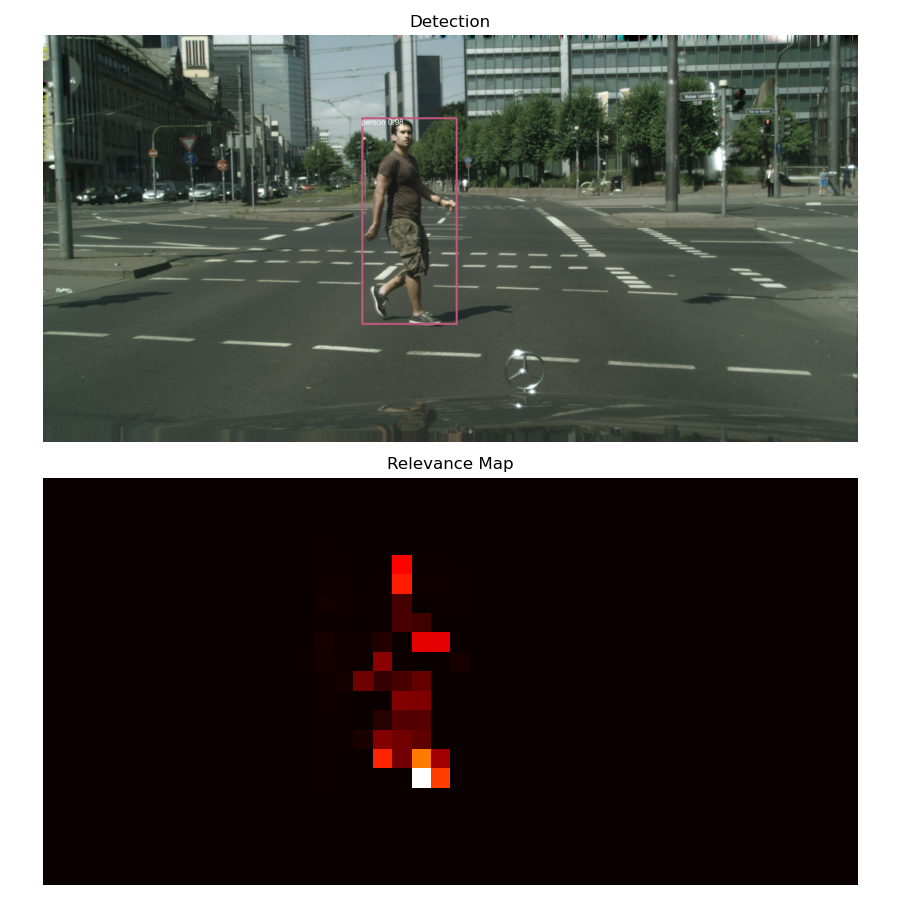
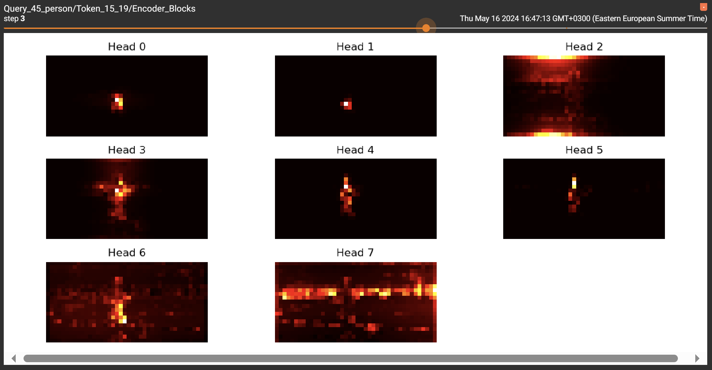
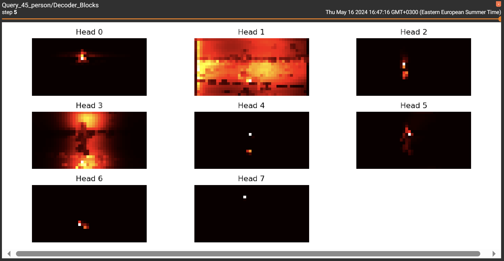

# Visual Explanations for Object Detection in Transformer-based architectures using Relevance Propagation

- **Still under development**: Repository for my thesis project. It focuses on enhancing interpretability in transformer-based architectures 
for object detection tasks.
- This project is built upon prior research outlined in [Generic Attention-model Explainability for Interpreting Bi-Modal and Encoder-Decoder Transformers](https://openaccess.thecvf.com/content/ICCV2021/papers/Chefer_Generic_Attention-Model_Explainability_for_Interpreting_Bi-Modal_and_Encoder-Decoder_Transformers_ICCV_2021_paper.pdf).
- Currently working with the [DETR model](https://huggingface.co/docs/transformers/main/en/model_doc/detr) from Hugging Face's Transformers library.
- The algorithm generates a relevance map of the image tokens wrt to a query token (detection) which are input to the encoder of the DETR model.
- Visualization are presented in `Tensorboard`.

# Results

- This is the relevance map for the detection of a pedestrian.

- In `Tensorboard` we can also see the attention maps of each head for all encoder and decoder blocks for tokens with a high relevance score.

