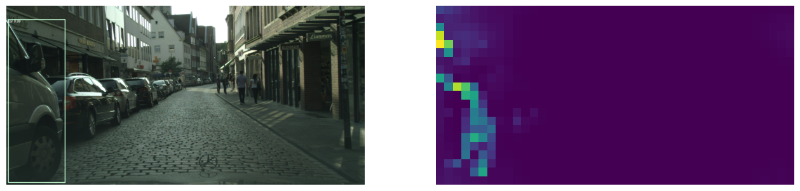
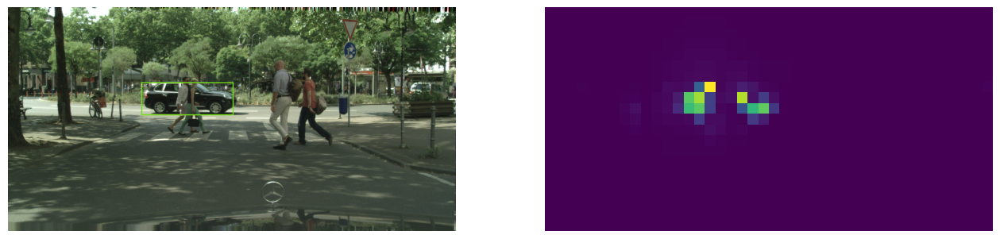
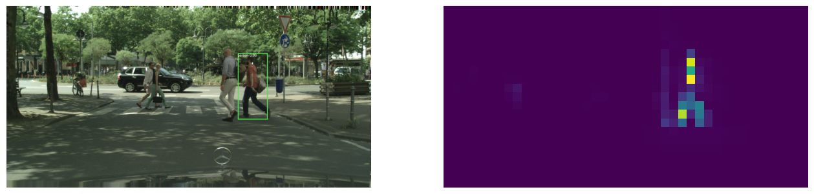
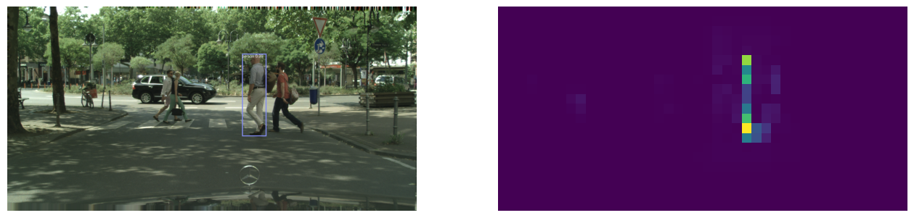

# Visual Explanations for Object Detection in Transformer-based architectures using Relevance Propagation

- Repository for my thesis project. It focuses on enhancing interpretability in transformer-based architectures 
for object detection tasks.
- This project is built upon prior research outlined in [Generic Attention-model Explainability for Interpreting Bi-Modal and Encoder-Decoder Transformers](https://openaccess.thecvf.com/content/ICCV2021/papers/Chefer_Generic_Attention-Model_Explainability_for_Interpreting_Bi-Modal_and_Encoder-Decoder_Transformers_ICCV_2021_paper.pdf).
- Currently working with the [DETR model](https://huggingface.co/docs/transformers/main/en/model_doc/detr) from Hugging Face's Transformers library.
- Here are some examples of visualizing the relevance scores assigned to each input token of the encoder wrt a particular `object query` token, 
as described in the [DETR paper](https://arxiv.org/pdf/2005.12872.pdf).

## TO DO:

- Propagating the relevance of the tokens through the backbone, enabling the creation of saliency maps at input 
space resolution, offering deeper insights into patterns identified by the model within input images 
for specific detections.
